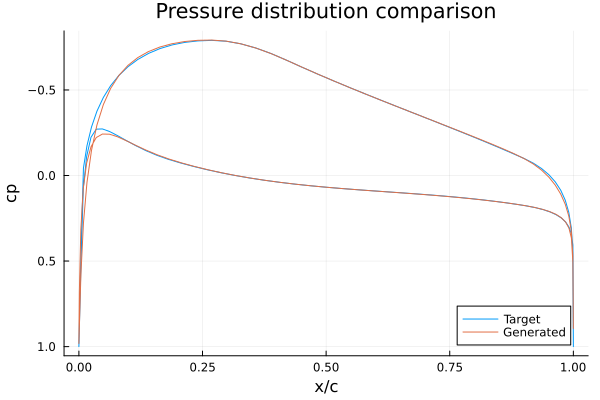
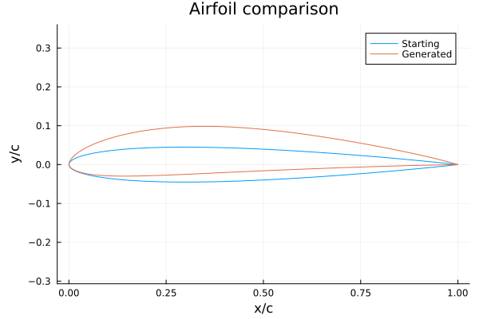
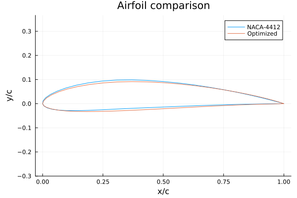
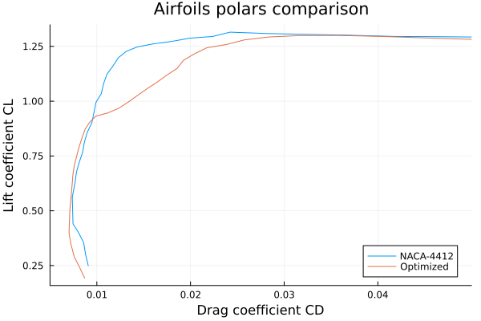

# AirfoilInverseDesign.jl

AirfoilInverseDesign.jl is a Julia package that implements the Modified Garabedian-McFadden Method (MGM) for airfoil inverse design. The package takes a target pressure distribution as input and outputs the airfoil geometry that generates it. Additionally, the package embeds a parametrization of the pressure distribution, enabling the optimization of the airfoil geometry for a given application.

Features
--------

* Modified Garabedian-McFadden Method (MGM) for airfoil inverse design
* Capability to generate the airfoil geometry that generates a given target pressure distribution
* Parametrization of the pressure distribution for optimal airfoil design ("flow feature parametrization")
* Embedded Multi Fidelity Inverse Design (EMFID) method for low-cost global and local airfoil optimization
* Low-dimensional searching space
* Robust nonlocal and smooth geometry variations to avoid over-optimized geometries
* Easy performance constraints (e.g. on the operating CL value)

Installation
------------

To install AirfoilInverseDesign.jl, follow these steps:

1. Open Julia REPL by running `julia` in your terminal or command prompt.
2. Press the `]` key to enter in Package manager mode.
3. Run `add https://github.com/pavanandrea/AirfoilInverseDesign.jl` to add the package to your Julia environment.
4. Load the package by running `using AirfoilInverseDesign`.

Getting started
---------------

Here is a simple example to use AirfoilInverseDesign.jl:

```julia
using AirfoilInverseDesign;
using Plots;

#define the starting airfoil (a NACA-0009 with 100 nodes)
(airfoil0,airfoil0header) = generatenaca4airfoil("0009", 100);

#define the target pressure distribution from a set of 10 parameters
#and evaluate it at the airfoil0 nodes
params = [0.27, -0.79, 0.4, 1.8, -0.1, 0.04, -0.275, 3.3, 5.5, 0.175];
cptarget = cpgen10h(params, airfoil0[:,1]);

#airfoil inverse design
(airfoil,status) = mgm(cptarget, airfoil0);

#analyze the generated airfoil with an inviscid panel method at α=0°
(cp,CL,CM,CD,_) = panel1(airfoil, 0);

#compare pressure distributions
plt1 = plot(cptarget[:,1], cptarget[:,2], label="Target",
    title = "Pressure distribution comparison",
    xlabel = "x/c",
    ylabel = "cp",
    yflip = true
);
plot!(plt1, cp[:,1], cp[:,2], label="Generated");
display(plt1);

#plot the new airfoil geometry
plt2 = plot(airfoil0[:,1], airfoil0[:,2], label="Starting",
    title = "Airfoil comparison",
    xlabel = "x/c",
    ylabel = "y/c",
    aspect_ratio = :equal
);
plot!(plt2, airfoil[:,1], airfoil[:,2], label="Generated");
display(plt2);
```

This will produce a plot showing the target pressure distribution and the resulting airfoil geometry:

<p align="center">
    
    
</p>

Airfoil optimization
--------------------

AirfoilInverseDesign.jl can easily optimize the shape of an airfoil given the operating conditions. The following pictures show how a NACA-4412 can be locally optimized to work better at low CL values, while maintaining the same CLmax and thickness:

<p align="center">
    
    
</p>


Note that this example only takes a few minutes on an average desktop computer to increase aerodynamic efficiency by 14% at CL=0.4!

|  Airfoil   |   CD @CL=0.4      |   CL/CD @CL=0.4   |   CD @CL=0.8      |   CL/CD @CL=0.8   |
|-----------:|------------------:|------------------:|------------------:|------------------:|
|  NACA-4412 | 0.008053          | 49.7              | 0.008582          | 93.2              |
|  Optimized | 0.007027          | 56.9 (+14.5%)     | 0.008169          | 97.9 (+5.1%)      |

The resulting polar curve does not exhibit the classic "spike" that plagues airfoils optimized by traditional method. Instead, thanks to the flow-feature parametrization, it presents a wide plateau that facilitates the practical use of the airfoil and makes the design less sensitive to perturbations.
Obviously the NACA-4412 performs better at high CL values, since the optimizer sacrificed efficiency outside the desired range.

See example/airfoil_global_optimization.jl and example/airfoil_local_optimization.jl and the documentation for more details.

License
-------

AirfoilInverseDesign.jl is licensed under the MIT License. See the file named LICENSE for more information.

Contributions
-------------

This package is a scratch reimplementation in Julia of my Bachelor's final project, which was originally written in MATLAB within the [LiftUp student team](https://www.teamliftup.it/). The goal of the project was to design an optimized airfoil for a fixed-wing drone to compete in the Air Cargo Challenge.

For this reason, I'm not accepting contributions to the codebase. However I welcome any question, feedback or request you may have.

Issues
------

If you encounter any issues while using AirfoilInverseDesign.jl, please open an issue ticket and provide detailed information about the problem you are experiencing.
