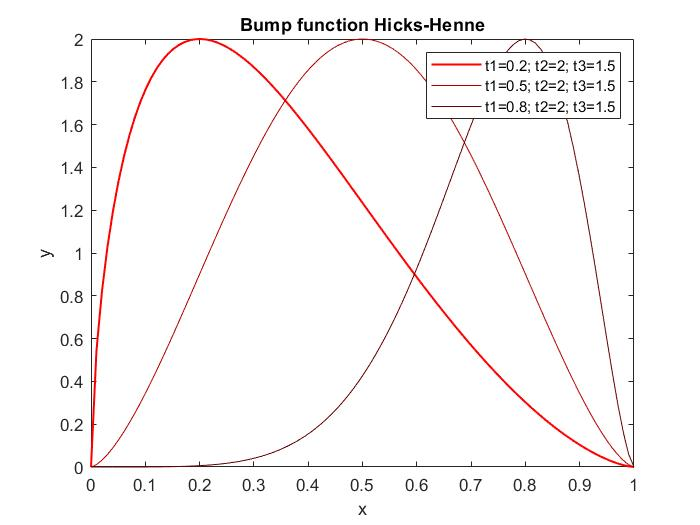

# cpgen10h
Traditionally, to optimize an airfoil shape engineers choose to directly parametrize the upper and lower gometry curves, for example using Bezier curves.
Instead, the idea behind the EMFID method is to parametrize the pressure distribution cp(x) around the airfoil, and to find the corresponding geometry using an inverse design method like the MGM.
At first glance this approach can seem to be unneccessarily involved, but it offers several numerical advantages:
* lower number of parameters needed to represent the search space
* it is possible to embed performance constraints into the parametrization, since the CL and the CM are given by the area inside the cp(x) curves
* a localized perturbation on pressure distribution leads to a whole different airfoil, consequently:
* optimized airfoils are less sensitive to real-world perturbations and geometrical errors, and
* optimizers are less likely to get stuck in a local minima

It is worth noting that performance is ultimately the only thing that matter when flying, not the shape itself. From this point of view, parametrizing cp(x) makes more sense than parametrizing y(x).

### Parametrization
cpgen10h is heavily based on the Hicks-Henne bump function:

$$ f(x) = t_2 \left[ \sin \left( π x^\frac{\ln 0.5}{\ln t_1} \right) \right]^{t_3}  $$

where $t_1$, $t_2$, $t3$ are parameters. In particular, $t_1$ is the x position of the maximum point, $t_2$ is the maximum value, and $t_3$ is the function curvature.

    

The Hicks-Henne bump function is a good choice to model the pressure distribution $c_P(x)$, especially near the leading edge and the trailing edge, and has only 3 parameters.

The cpgen10h parametrization makes use of three piecewise-defined Hicks-Henne functions:
* $ 0 \leq x/c \leq \min (c_P) $: Hicks-Henne function with 3 parameters
* $ \min (c_P) \leq x/c \leq \min (c_P)+0.15 $: Hicks-Henne function with 1 parameter ($t_1$ and $t_2$ are defined from the previous curve)
* $ \min (c_P)+0.15 \leq x/c \leq 0.9 $: cubic polynomial with no additional parameters (it is fully defined from the previous and the following curves)
* $ 0.9 \leq x/c \leq 1 $: mirrored Hicks-Henne function with 1 parameter ($t_2$ and $t_3$ are determined empirically)

For a total of 5 parameters on the upper surface and 5 parameters on the lower surface:
* $p_1$: x-coordinate of the minimum cp (upper surface)
* $p_2$: minimum cp value (upper surface)
* $p_3$: function curvature before the minimum cp (upper surface)
* $p_4$: function curvature after the minimum cp (upper surface)
* $p_5$: cp value at x/c=0.9 (upper surface)
* $p_6$: x-coordinate of the minimum cp (lower surface)
* $p_7$: minimum cp value (lower surface)
* $p_8$: function curvature before the minimum cp (lower surface)
* $p_9$: function curvature after the minimum cp (lower surface)
* $p_{10}$: cp value at x/c=0.9 (lower surface)

Note that the curvatures can have values up to 15. This is not a good practice in the field of numerical optimization; to normalize the parameters in the range $ 0 \leq p \leq 1 $, the most recent versions of cpgen10h are applying the $\arctan$ function.
