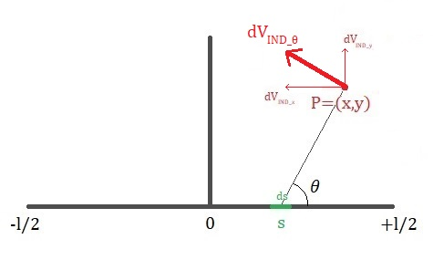
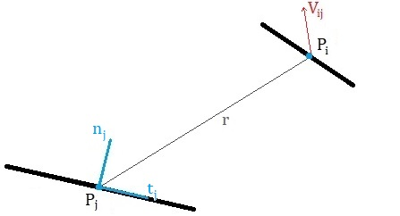
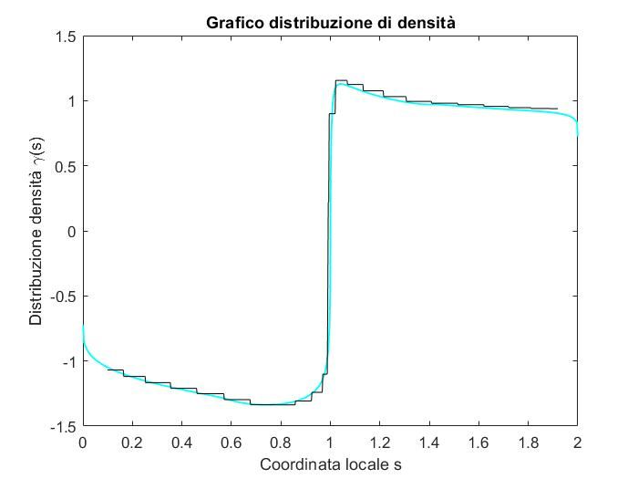
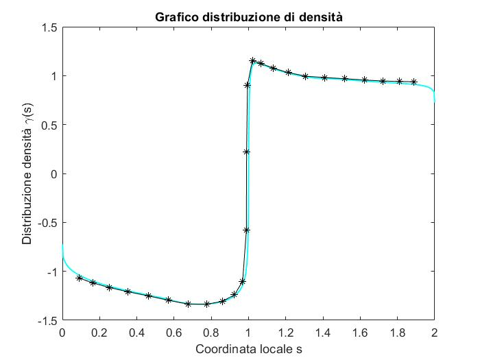

# panel1
In the Linear Vortex method, each panel has a vorticity density γ that varies linearly. Being of order 1, it is faster and more accurate than the Hess-Smith method, but its mathematical derivation is slightly more elaborate.

Consider a panel $AB$ of length $l$, centered at the origin and positioned along the x axis, with a linearly varying vorticity density $γ(s)$: it takes the value $γ_A$ at point A and the value $γ_B$ at point B.

    

The goal is to calculate the velocity field $V_{IND} = \left[ V_{IND-x}, V_{IND-y} \right]$ induced by the panel at a generic point $P=(x,y)$, by integrating the contributions $dV_{IND}$ generated by the vortex distribution $dΓ = γ(s)ds$ all over the panel.

### x-component
Let's now calculate the x component of the velocity field induced by the panel:

$$ dV_{IND-x} = \int_{-l/2}^{+l/2} -dV_{IND} \sin \theta = \int_{-l/2}^{+l/2} -\frac{dΓ}{2πr} \frac{y}{r} = -\frac{1}{2π} \int_{-l/2}^{+l/2} \frac{y}{r^2} γ(s) ds $$

where $s$ is the position of the infinitesimal vortex $dΓ = γds$, and $r=\sqrt{y^2+(x-s)^2}$ is the distance between the infinitesimal vortex and the point $P$.

A linear distribution $γ(s)$ acts on the panel, whose equation is that of the line passing through the points $(-l/2,γ_A)$ and $(+l/2,γ_B)$:

$$ γ(s) = γ_A + \left( γ_B - γ_A \right) \frac{s+l/2}{l} $$

Substituting into the integral yields to:

$$ V_{IND-x} = \int_{-l/2}^{+l/2} \frac{y}{y^2 + (x-s)^2} \left[ γ_A + \left( γ_B - γ_A \right) \frac{s+l/2}{l} \right] ds $$

Omitting the calculus steps, this integral with respect to variable s has the following primitive:

$$ \frac{1}{2l} \left( \left[ γ_A (l-2x) + γ_B (l+2x) \right] \arctan \left( \frac{s-x}{y} \right) + y (γ_B - γ_A) \ln \left[ y^2 + (x-s)^2 \right] \right) + const $$

Therefore:

$$ V_{IND-x} = -\frac{1}{4πl} \left[ \left[ γ_A (l-2x) + γ_B (l+2x) \right] \arctan \left( \frac{s-x}{y} \right) + y (γ_B - γ_A) \ln \left[ y^2 + (x-s)^2 \right] \right]^{s=+l/2}_{s=-l/2} $$

To make the notation lighter, let's define the following quantities:

$$ C = \ln \left( \frac{y^2+(x+l/2)^2}{y^2+(x-l/2)^2} \right) $$

$$ D = \arctan \left( \frac{x+l/2}{y} \right) - \arctan \left( \frac{x-l/2}{y} \right) $$

Some simple algebraic steps lead to:

$$ V_{IND-x} = - \frac{γ_A}{4πl} \left[ (l-2x) D + y C \right] - \frac{γ_B}{4πl} \left[ (l+2x) D - y C \right] $$

Note that the correctness of the result can be verified by putting $γ_A = γ_B = γ$ to obtain the same expression of the Hess-Smith method.

### y-component
In a completely analogous manner, it is possible to obtain the y component of the velocity field induced by the panel:

$$ dV_{IND-y} = \int_{-l/2}^{+l/2} dV_{IND} \cos \theta = \int_{-l/2}^{+l/2} \frac{dΓ}{2πr} \frac{x-s}{r} = \frac{1}{2π} \int_{-l/2}^{+l/2} \frac{x-s}{r^2} γ(s) ds $$

Substituting the linear distribution $γ(s)$ leads to an integral with the following primitive:

$$ -\frac{1}{4l} \left( \left[ γ_A (l-2x) + γ_B (l+2x) \right] \ln \left[ y^2 + (x-s)^2 \right] + 4y(γ_A - γ_B) \arctan \left( \frac{s-x}{y} \right) -4(γ_A - γ_B)(s-x) \right) + const $$

The final expression written as a linear combination of $γ_A$ and $γ_B$ is:

$$ V_{IND-y} = \frac{γ_A}{8πl} \left[ (l-2x) C - 4yD + 4l \right] + \frac{γ_B}{8πl} \left[ (l+2x) C + 4yD - 4l \right] $$

Note that it is useful to rearrange the expressions as a linear combination of $γ_A$ and $γ_B$. This will come handy later when writing the impermeability conditions.

### Boundary conditions
Since the influence of each panel on all others is known, it is now possible to impose a tangent flow on all panels.

    

The unknowns to be determined here are the various $γ_A$, $γ_B$ for each of the N panels. At first sight, it would seem to be facing an unsolvable problem, with 2N unknowns but only N+1 equations (impermeability and Kutta). However, a first-order method like Linear Vortex can discretize a singularity distribution with continuous linear segments, unlike the Hess-Smith method that is piecewise constant. This means that the $γ_B$ of the i-th panel is also the $γ_A$ of the (i+1)-th panel, hence there is an unknown for each point on the profile and the problem is well-posed.

    
    

This essentially means that the Linear Vortex method has the same computational cost as the Hess-Smith method, but one order of accuracy more.

Let's now write the impermeability condition on the generic i-th panel, summing all the velocity contributions from the N panels in the point $P_i$ and then imposing its normal component to be zero:

$$ 0 = \sum_{j=1}^N \vec{V}_{ij} \cdot \vec{n}_i + \vec{V}_∞ \cdot \vec{n}_i = \sum_{j=1}^N \left[ V_{IND-x} \vec{t}_j + V_{IND-y} \vec{n}_j \right] \cdot \vec{n}_i + \vec{V}_∞ \cdot \vec{n}_i $$

$$ 0 = \sum_{j=1}^N  \left[ γ_j \left( A_{xij} \vec{t}_j + A_{yij} \vec{n}_j \right) \cdot \vec{n}_i + γ_{j+1} \left( B_{xij} \vec{t}_j + B_{yij} \vec{n}_j \right) \cdot \vec{n}_i \right] + \vec{V}_∞ \cdot \vec{n}_i $$

Where $A_{xij}=-\frac{(l-2x)D+yC}{4πl}$, $B_{xij}=-\frac{(l+2x)D-yC}{4πl}$, $A_{yij}=\frac{(l-2x)C-4yD+4l}{8πl}$, $B_{yij}=\frac{(l+2x)C+4yD-4l}{8πl}$.

Note that when $i=j$ (effect of a panel on itself), the induced velocity expressions simplify to $ V_{IND-x} = \frac{γ_A}{4} + \frac{γ_B}{4} $ and $ V_{IND-y} = \frac{γ_A}{2π} - \frac{γ_B}{2π} $, hence $A_{xij} = \frac{1}{4}$, $B_{xij} = \frac{1}{4}$, $A_{yij} = \frac{1}{2π}$, $B_{yij} = -\frac{1}{2π}$.

The Kutta condition is simply written as:

$$ γ_1 = γ_{N+1} $$

That way it is possible to write the system of linear equations sought to obtain the unknowns $γ_i$. It should be noted that the construction of the aerodynamic influence matrix is more complex compared to the Hess-Smith method. The computational cost of the linear solver is approximately the same, however the building phase is significantly more expensive.

### Aerodynamic coefficients
After discretizing and calculating the vorticity distribution $γ$, it is finally possible to determine the velocity field V around the profile.

In the Hess-Smith method, the tangential velocity component is evaluated on each panel and then Bernoulli's equation is applied to calculate the pressure. However, in the case of Linear Vortex, the tangential velocity is already known! In fact, one of the advantages of using only vortices as singularities is precisely being able to use the formula for the local velocity jump:

$$ γ = V_{t-EXTERNAL} - V_{t-INTERNAL} $$

But if the airfoil is not moving then $V_{t-INTERNAL}=0$! We then simply have that $γ$ equals the tangent velocity, with a significant reduction in calculation times compared to Hess-Smith. This simple 'shortcut' halves the computational cost of the entire method.

Also, this method allows the velocity field to be evaluated not on the centers of the panels, but on the nodes of the profile. This is particularly desirable, especially in inverse design codes, and avoids having to interpolate or change nodes at every iteration.

Finally, the pressure distribution $c_P$ on the nodes can be calculated with Bernoulli's equation:

$$ c_P = 1 - \frac{V_{t}^2}{V_∞^2} = 1 - \frac{γ^2}{V_∞^2} $$

Regarding the aerodynamic coefficients, it is necessary to integrate the pressure contributions over the entire profile border. This can be done analytically since the vorticity distribution $γ(s)$ is known:

$$ γ(s) = γ_i + \frac{γ_{i+1}-γ_i}{l} (s-s_i) \rightarrow c_P(s) = 1-γ^2(s) $$

where $s_i$ is the local position of node i. Using Bernoulli's equation, the pressure distribution $c_P(s)$ on the panel is calculated and, by integrating it, the average pressure force is determined:

$$ F_i = \int_{s_j}^{s_{j+1}} c_P(s)ds = \int_{s_j}^{s_{j+1}} 1-\left[ s_i + \frac{γ_{i+1}-γ_i}{l} (s-s_i) \right]^2ds = l \left( 1 - \frac{γ_{j+1}^2}{3} - \frac{γ_{j}^2}{3} - \frac{γ_{j}γ_{j+1}}{3} \right) $$

By summing the forces on all panels, the resulting force is obtained:

$$ C_L = \sum_{i=1}^N F_i \vec{n}_i \cdot \left[ 0, 1 \right] $$

$$ C_D = \sum_{i=1}^N F_i \vec{n}_i \cdot \left[ 1, 0 \right] $$

$$ C_M = \sum_{i=1}^N (\vec{P}_i-\left[0.25, 0\right]) \times F_i \vec{n}_i $$

To summarize, the Linear Vortex method presented here has the following advantages over the Hess-Smith method:
1. Greater precision thanks to a higher order 
2. More accurate Kutta condition
3. Faster calculation thanks to the formula for the local jump in velocity
4. Results written on the nodes and not on the panels.

And it has no practical disadvantage.
